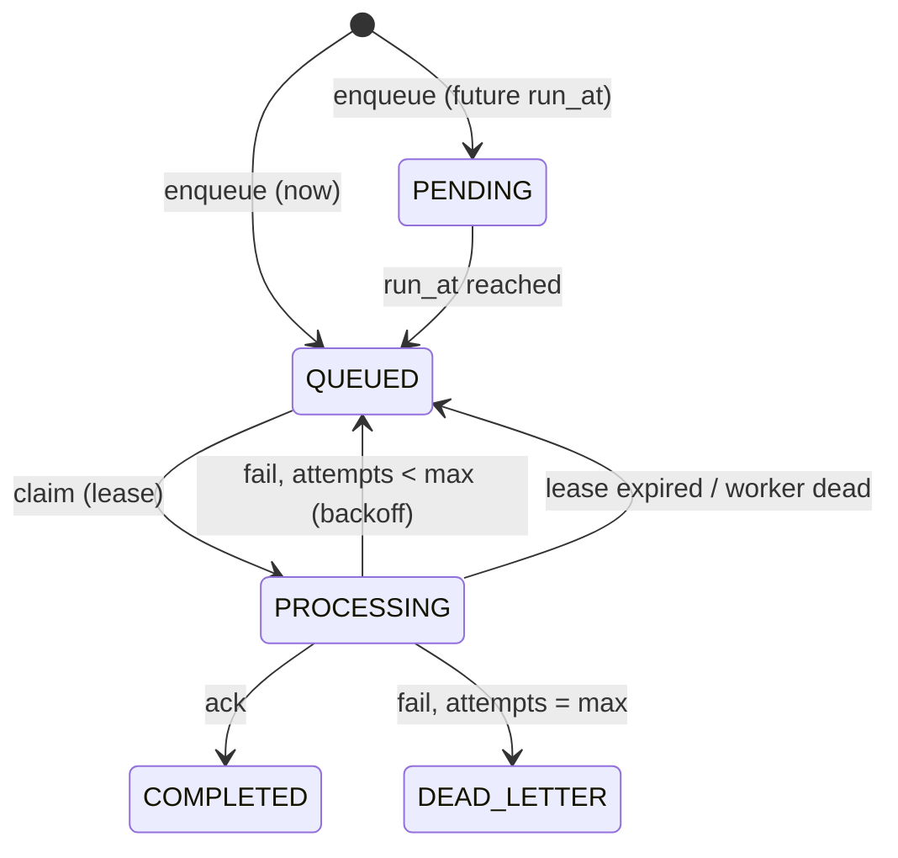

# Docket — Architecture

_As of 2026-09-18_

## Overview

Docket is a distributed job queue: a broker service that accepts jobs over
HTTP and hands them to a fleet of workers that register their capabilities,
claim work, and report back. It exists to learn distributed-systems
mechanics — leasing, retries, idempotency, failure recovery — by building
them, while producing a portfolio-grade project at zero infrastructure cost.

The full teaching-oriented HLD — vocabulary, SQL walkthroughs, every phase in
detail — lives in a separate design doc; this file is the working reference
for how the system is actually built.

For module layout, the job-lifecycle diagram, and the API table, see the
[README](../README.md) — this doc covers the decisions behind that
structure and the mechanisms it's built on.

## Stack & structure decisions

| Decision | Why |
| --- | --- |
| Broker is a real HTTP service (NestJS + Fastify), not an embedded library | Workers as separate processes talking over HTTP is a genuine network boundary — what makes this a distributed system rather than a library with a database |
| Prisma 7 + `@prisma/adapter-pg` on Postgres; no Redis backend | One storage engine; `SELECT … FOR UPDATE SKIP LOCKED` gives durable, transactional, free concurrency control without running a second engine |
| Single-package repo mirroring orion's hexagonal conventions, not a multi-package workspace | Matches tooling and layering already in use — `domain/application/infrastructure/http` per module, Symbol-token ports, `#`-import aliases |
| Worker (`worker/`) is plain TypeScript, zero dependencies, no NestJS | It's a polling CLI loop, not a server — Nest's DI buys nothing there |
| Jest, not Vitest; Testcontainers for the SKIP LOCKED path | Matches orion's test runner; a mocked ORM can't verify real row-locking concurrency |

## Core mechanisms

No separate FAILED/RETRY state — a retry is the PROCESSING → QUEUED edge with
`attempts` incremented and `lastError` set.

- **Claim**: `SELECT … FOR UPDATE SKIP LOCKED` — concurrent claims never
  block each other or double-hand a job.
- **Lease**: a claimed job gets `lease_expires_at`; a worker that dies
  without acking loses the job back to the pool.
- **Heartbeat + recovery**: workers ping every ~5s; a broker loop marks
  silent workers DEAD, reclaims their in-flight jobs immediately, and
  separately reclaims any job whose lease expired — belt and suspenders.
- **Backoff**: exponential with jitter, `base × 2^(attempts-1)` capped and
  randomized, so a burst of failures doesn't retry in lockstep.
- **Idempotency**: submission-time (`idempotencyKey`, unique constraint —
  resubmitting returns the same job) and execution-time (handlers get
  `jobId`/`attempt` to dedupe their own side effects; delivery is
  at-least-once by design, never exactly-once).
